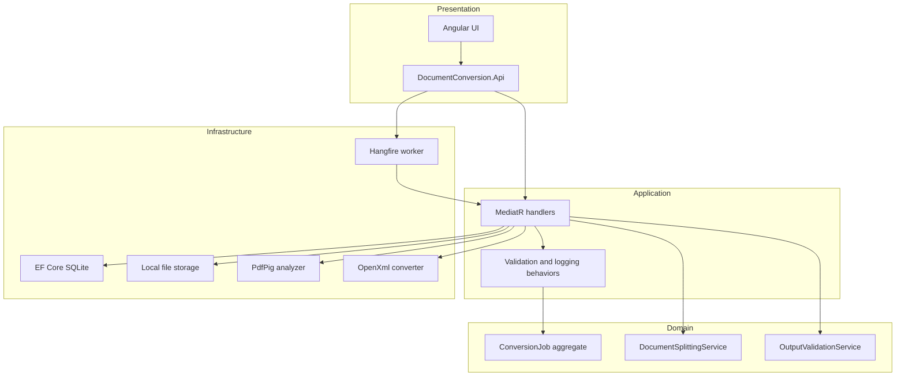

# Document Conversion & Splitting Service

Take-home assessment implementation: **Angular** frontend + **.NET 8** backend with **Clean Architecture**, **DDD**, **MediatR** (with validation/logging pipeline behaviors), and **Hangfire** background processing.

## Conversion choice

- **Input:** PDF  
- **Output:** DOCX (deterministic copy of text + embedded images; no OCR/AI)  
- **Libraries:** [PdfPig](https://www.nuget.org/packages/PdfPig) + [DocumentFormat.OpenXml](https://www.nuget.org/packages/DocumentFormat.OpenXml)

## Architecture (Clean Architecture + DDD)



## Assessment requirement map (§4.x)

| Requirement | Implementation | How to verify |
|-------------|----------------|---------------|
| **§4.1** PDF intake + output format | [`JobsController`](backend/src/DocumentConversion.Api/Controllers/JobsController.cs), [`SubmitConversionJobCommandValidator`](backend/src/DocumentConversion.Application/Jobs/Validators/JobCommandValidators.cs) | Swagger or curl POST; non-PDF → **400** |
| **§4.1** Sample PDFs | [`samples/`](samples/) + [`SamplePdfGenerator`](backend/tools/SamplePdfGenerator/) | Four files including mixed and large |
| **§4.2** Deterministic PDF→DOCX | [`OpenXmlDocumentConverter`](backend/src/DocumentConversion.Infrastructure/Conversion/), [`PdfPigAnalyzer`](backend/src/DocumentConversion.Infrastructure/Conversion/) | Demo step 1; [`OpenXmlDocumentConverterTests`](backend/tests/DocumentConversion.Application.Tests/OpenXmlDocumentConverterTests.cs) |
| **§4.2** Scanned-only failure | [`ScannedDocumentNotSupportedException`](backend/src/DocumentConversion.Domain/Jobs/Exceptions/DomainExceptions.cs) | Demo step 2; [`DocumentConversion.Api.Tests`](backend/tests/DocumentConversion.Api.Tests/) |
| **§4.3** Size splitting (2 MB default) | [`DocumentSplittingService`](backend/src/DocumentConversion.Domain/Jobs/Services/DocumentSplittingService.cs), `Conversion:MaxOutputPartSizeBytes` | Demo step 4; [`DocumentSplittingServiceTests`](backend/tests/DocumentConversion.Domain.Tests/DocumentSplittingServiceTests.cs) |
| **§4.4** Post-conversion validation | [`OutputValidationService`](backend/src/DocumentConversion.Domain/Jobs/Services/OutputValidationService.cs) → **NeedsReview** | Demo step 6 + [`OutputValidationServiceTests`](backend/tests/DocumentConversion.Domain.Tests/OutputValidationServiceTests.cs) |
| **§4.5** Exception handling + audit | Domain exceptions, [`ProcessConversionJobExceptionHandlers`](backend/src/DocumentConversion.Application/Jobs/Commands/ProcessConversionJobExceptionHandlers.cs), `JobEvent` timeline | Failed jobs in UI timeline; API integration tests |
| **§4.6** Job history UI | Angular submit / list / detail with polling | Demo steps 1–4 |
| **§5** Automated tests | Domain, Application, **Api** integration | `dotnet test` from `backend/` |

Further trade-offs and edge-case rules: [ASSUMPTIONS.md](ASSUMPTIONS.md).

## Prerequisites

- [.NET 8 SDK](https://dotnet.microsoft.com/download)
- [Node.js 20+](https://nodejs.org/) (for Angular)

## Backend

```powershell
cd backend/src/DocumentConversion.Api
dotnet run
```

- API: http://localhost:5104  
- Swagger: http://localhost:5104/swagger  
- Hangfire dashboard (Development): http://localhost:5104/hangfire  

### Configuration (`appsettings.json`)

| Setting | Default | Description |
|---------|---------|-------------|
| `Conversion:MaxOutputPartSizeBytes` | `2097152` (2 MB) | Split threshold for DOCX parts |
| `Conversion:MaxUploadSizeBytes` | `52428800` | Upload limit |

In Production, override `ConnectionStrings:Default` and `ConnectionStrings:Hangfire` via environment variables if needed.

SQLite files: `app.db` (jobs), `hangfire.db` (queue). Uploaded files: `storage/`.

## Building Blocks vs Document Conversion

Shared kernel (no dependencies) lives under [`backend/src/Shared/`](backend/src/Shared/). Cross-cutting infrastructure lives under [`backend/src/BuildingBlocks/`](backend/src/BuildingBlocks/):

| Project | Purpose |
|---------|---------|
| **Shared** | `BusinessException`, `Guard`, shared `Error` record — no NuGet dependencies |
| **BuildingBlocks.Application** | MediatR `ValidationBehavior`, `LoggingBehavior`, `UnhandledExceptionBehavior`; register via `AddBuildingBlocksBehaviors()` |
| **BuildingBlocks.Api** | `GlobalExceptionMiddleware` — 400 validation, 422 business, 500 unhandled; use `UseBuildingBlocksExceptionHandling()` |
| **BuildingBlocks.Domain** | `Entity`, `AggregateRoot`, `IAggregateRoot`; `ModuleDomainException<TErrorCode>` for module exceptions → `BusinessException` in Shared |
| **BuildingBlocks.Infrastructure** | `AddBuildingBlocksSqliteDbContext<T>()`, `AddBuildingBlocksHangfireSqlite()` — shared EF/Hangfire setup |

**Document Conversion** (`DocumentConversion.*`) is the first bounded context: domain rules, handlers, infrastructure, and API endpoints. Job domain types live under [`DocumentConversion.Domain/Jobs/`](backend/src/DocumentConversion.Domain/Jobs/) (aggregates, entities, enums, services, etc.). Module-specific exceptions (e.g. `ScannedDocumentNotSupportedException`) extend `DomainException` → `ModuleDomainException<DomainErrorCode>` in [`Jobs/Exceptions`](backend/src/DocumentConversion.Domain/Jobs/Exceptions/DomainExceptions.cs).

When adding a new module: reference `Shared` and `BuildingBlocks.Domain`, define your own error enum and exception types, call `cfg.AddBuildingBlocksBehaviors()` in that module’s Application layer, use `BuildingBlocks.Infrastructure` in that module’s Infrastructure project, and use the same API middleware in the host.

## Frontend

```powershell
cd frontend/document-conversion-ui
npm install
npm start
```

App: http://localhost:4200 (proxied API URL in `src/environments/environment.ts` → `http://localhost:5104/api`).

## Sample PDFs

Regenerate under `samples/`:

```powershell
cd backend
dotnet run --project tools/SamplePdfGenerator/SamplePdfGenerator.csproj
```

Includes: `text-based.pdf`, `scanned-image-only.pdf`, `mixed-text-and-scan-pages.pdf`, `large-multi-page.pdf`.

## Tests

```powershell
cd backend
dotnet test
```

Includes unit tests (splitting, validation, conversion adapter, MediatR validation behavior) and **API integration tests** (`DocumentConversion.Api.Tests`) that run the full submit → process pipeline synchronously in-process (no flaky Hangfire polling).

### Submit a job via curl (optional)

```powershell
curl.exe -X POST "http://localhost:5104/api/jobs" `
  -F "file=@samples/text-based.pdf" `
  -F "outputFormat=Docx"
```

Use Swagger at `/swagger` for multipart upload if you prefer a UI.

## Interview demo (suggested)

1. Submit `samples/text-based.pdf` → **Completed**, download DOCX part.  
2. Submit `samples/scanned-image-only.pdf` → **Failed** (`ScannedDocumentNotSupported`) with timeline in UI.  
3. Submit `samples/mixed-text-and-scan-pages.pdf` → **Completed** (text pages copied; image-only pages as embedded images — see ASSUMPTIONS scanned rule).  
4. Submit `samples/large-multi-page.pdf` → **Completed** with **Part 1 of N** labels and downloads.  
5. Open Hangfire dashboard: http://localhost:5104/hangfire — show enqueued/succeeded processing jobs.  
6. **NeedsReview (§4.4):** samples rarely hit this in the UI; open [`OutputValidationServiceTests`](backend/tests/DocumentConversion.Domain.Tests/OutputValidationServiceTests.cs) and [`ConversionJob.MarkNeedsReview`](backend/src/DocumentConversion.Domain/Jobs/Aggregates/ConversionJob.cs) — explain **Failed** (hard errors) vs **NeedsReview** (output integrity checks failed).

## Submission

- Repo or zip with `backend/`, `frontend/`, `samples/`, this README, and [ASSUMPTIONS.md](ASSUMPTIONS.md).  
- Submit within **4 calendar days** of receiving the assessment PDF.
